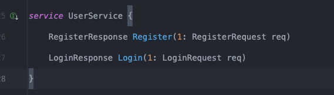

# [WIP]Architecture

本项目采用的是**六边形架构**，不再使用 kitex 生成的脚手架。

六边形架构以业务为核心，也就是传统项目中的 service 层，将 service 与各层进行解耦，使得各层之间的耦合度降低，方便单元测试，也方便后续的扩展。

## 架构中的相关概念
- service：也可以叫做 **application**， **core**等，意思就是业务逻辑层。
- ports：本质上就是**接口**定义的地方，包括**数据库**， **消息队列**， **外部服务**（RPC）等。当然也包括**service**，目的是使得 handler 层和 service 解耦。
- adapters：实现 ports 的所有具体类。实际上 service 也属于 adapter 的一种，单独拿出来 service 是为了体现 service 是架构**核心**的目的。
- domain：定义在 service/domain 中，用于 service，dao 之间的对象操作。domain 中的数据为该微服务所**独有**。

### 为什么需要有 domain
- domain 的另一个理解就是 service 层和 handler 层之间的 model

- 下面是通过 kitex 生成的 model，暴露给**外部调用**的 model，也可以叫做 rpc 信息交流的实体。
```go
type User struct {
	Id        *string `thrift:"id,1,optional" frugal:"1,optional,string" json:"id,omitempty"`
	Username  string  `thrift:"username,2,required" frugal:"2,required,string" json:"username"`
	AvatarUrl string  `thrift:"avatar_url,3,required" frugal:"3,required,string" json:"avatar_url"`
	Email     string  `thrift:"email,4,required" frugal:"4,required,string" json:"email"`
	Phone     string  `thrift:"phone,5,required" frugal:"5,required,string" json:"phone"`
}
```

- 下面是 domain 定义的 model，与上面明显的区别多了一个 password 的字段，很明显这个字段是不应该暴露给外部的，但是 service 和 dao 的操作却又是需要的。
```go
type User struct {
	Uid       int64
	UserName  string
	Password  string
	Email     string
	Phone     string
	AvatarURL string
}
```

## 项目结构
```bash
.
├── Makefile
├── cmd
│   └── user
│       └── main.go
├── config
│   └── config.go
├── deploy
├── doc
├── go.mod
├── go.sum
├── internal
│   └── user
│       ├── domain
│       │   └── user.go
│       ├── adapter
│       │   ├── db
│       │   │   └── db.go
│       │   └── rpc
│       │       └── handler.go
│       ├── ports
│       │   ├── db.go
│       │   └── service.go
│       └── service
│           ├── login.go
│           ├── register.go
│           └── service.go
└── pkg
    ├── idl
    │   ├── model.thrift
    │   └── user.thrift
    ├── kitex_gen
    │   ├── model
    │   └── user
    └── logger
```
- cmd：程序的启动入口，用于项目**初始化**和**依赖注入**。
- internal：各个微服务的具体实现，每个微服务分为```adapter```，```ports```，```service```三个部分。
- pkg：该部分的代码可用于其他外部项目调用。


### ports
定位到 [ports](../internal/user/ports) 目录。该部分我只定义了 db 层的接口和 service 层的接口。
#### db
定义出 service 层可以所需要的所有 db 操作。
```go
// DBPort 定义数据库接口，暴露给 core（service）使用
// 最简单的 CURD
type DBPort interface {
    GetUserByName(ctx context.Context, name string) (*domain.User, error)
    CreateUser(ctx context.Context, user *domain.User) (*domain.User, error)
}
```

通过这种方式，那么在 service 层的结构体中只需要存放 db 接口，从而实现了 service 层和 db 层的解耦。

```go
type UserService struct {
	db ports.DBPort
}
```

#### service
定义出 handler 层可以调用的所有 service 接口，实现了 handler 层和 service 层的解耦。
```go
// CorePort 定义核心业务接口，暴露给 rpc（handler 层）使用
type CorePort interface {
    RegisterUser(ctx context.Context, user *domain.User) (*domain.User, error)
    Login(ctx context.Context, user *domain.User) (*domain.User, error)
}

```

### kitex 做了什么
实际上在 ports 层应该也定义出 rpc 接口，而在六边形架构中也有 **domain**这一个概念，意思是服务间交流的业务实体。但是这些操作 kitex 都帮我们做了。

#### rpc ports
这也是现如今所有微服务框架帮用户实现的地方，我们不需要再次显示定义出 rpc 的接口，只需要关注于实现上，体现出解耦的思想。


点击旁边的绿色图标，就可以快速定位到你所依赖的接口。

### 所存在的问题
- 六边形架构非常好地体现出通过接口隔离各个层次的思想，但是在实际开发中，我们通常只会实现一次 service 类，也就是 handler 和 service 层直接不一定要通过接口进行隔离开来。但是使用了接口可以方便 handler 层的测试，也可以让代码层次看起来更清晰，如果后续核心业务有大改的话（实现另一套业务逻辑，但是想保留原有的 v1版本），也不会影响到 handler 层。